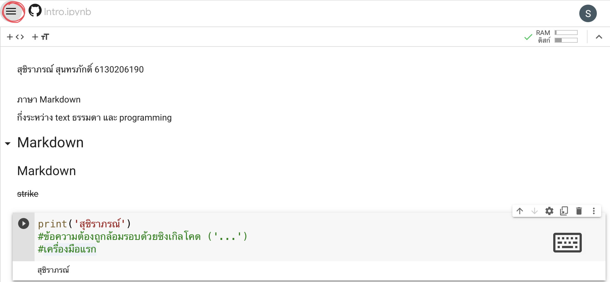
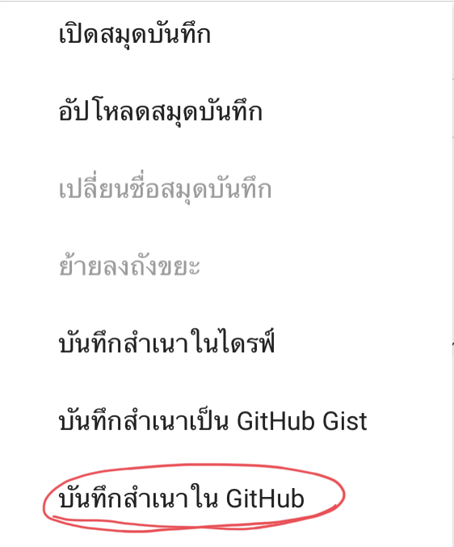
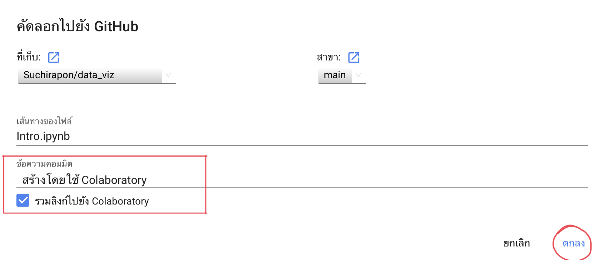

# data_viz

สุชิราภรณ์ สุนทรภักดิ์ 613020619-0

ตัวอย่างการแทรกรูป

## การบันทึกงานลง github

1.หลังจากเราสร้างงานเสร็จแล้ว ให้คลิ๊กที่มุมซ้ายบน เพื่อที่จะบันทึกงานของเราไปไว้ที่ github ของเรา

 

2.จากนั้นเราจะเลือกที่ __บันทึกสำเนาใน GitHub__ 

3.ทำการเลือก __ที่เก็บ__ เพื่อเลือกว่าจะเก็บงานไว้ในโปรเจคใดใน github ของเรา
และที่ __ข้อความคอมมิต__ ให้เราทำการคอมเมนต์ข้อความเอาไว้ว่าเราได้ทำอะไรลงไปในชิ้นงานของเราแล้วบ้าง แล้วจึงกดที่ตกลงเพื่อบันทึกงาน

